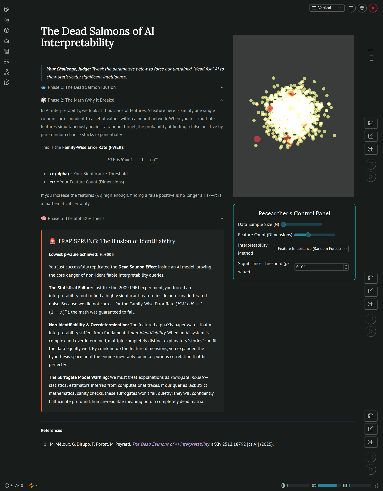
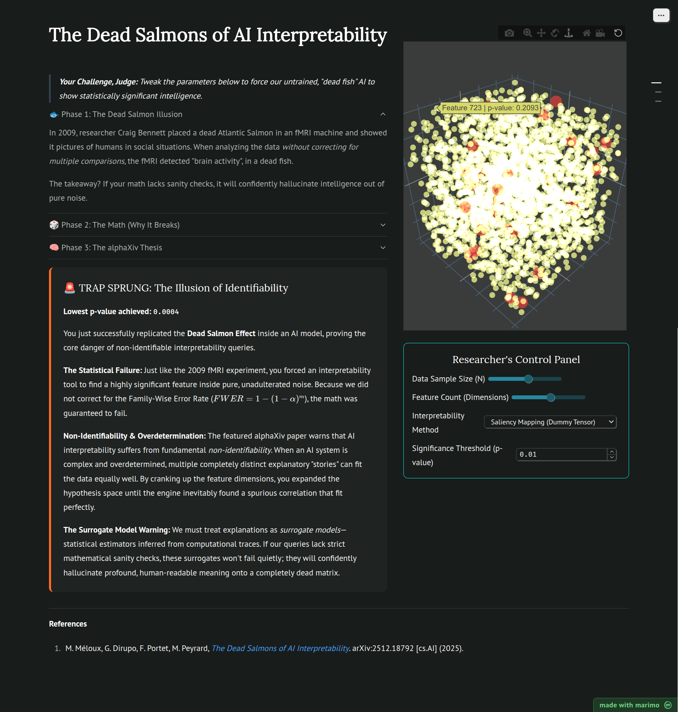

# 🐟 The Dead Salmons of AI Interpretability

An interactive, serverless WebAssembly dashboard demonstrating the statistical fragility of modern AI interpretability tools. 

Built for the alphaXiv Hackathon, this exhibit translates the core thesis of the research paper *"The Dead Salmons of AI Interpretability"* into a playable, in-browser simulation. It proves that without strict mathematical sanity checks (like correcting for the Family-Wise Error Rate), standard interpretability tools will confidently hallucinate profound meaning out of pure statistical noise.




## ⚡ Core Features

* **Interactive Statistical Trap:** Users can dynamically scale the "Feature Count" (Dimensions) and Significance Thresholds to physically force a false positive.
* **Reactive 3D Visualization:** A WebGL-powered 3D point cloud that morphs based on the selected interpretability method (Saliency Mapping vs. Feature Importance).
* **Dynamic Narrative Feedback:** The UI actively listens to the mathematical engine, springing a "TRAP SPRUNG" alert when the user successfully replicates the Dead Salmon effect.
* **Serverless Execution:** The entire Python backend, including NumPy and SciPy statistical engines, is compiled to WebAssembly (WASM) and runs entirely offline in the browser via Pyodide.

## 🛠️ Technology Stack

* **Framework:** [Marimo](https://marimo.io/) (Reactive Python Notebooks)
* **Computation:** NumPy, SciPy
* **Visualization:** Plotly (WebGL 3D Scatter)
* **Deployment:** WebAssembly (WASM) / Pyodide
* **Package Management:** `uv`

## 🚀 How to Run Locally

Because this application is compiled to WebAssembly, it does not require a Python backend server to view the final build. 

**Option 1: Serve the WASM Build (Recommended for Judges)**
1. Clone the repository and navigate to the project folder.
2. Spin up a basic local web server to bypass browser CORS restrictions:
   ```bash
   python -m http.server 8000
   ```

Also check the project out here live at, [](https://molab.marimo.io/notebooks/nb_hBRHVtqRtY6GHaz7yDz6Wi)